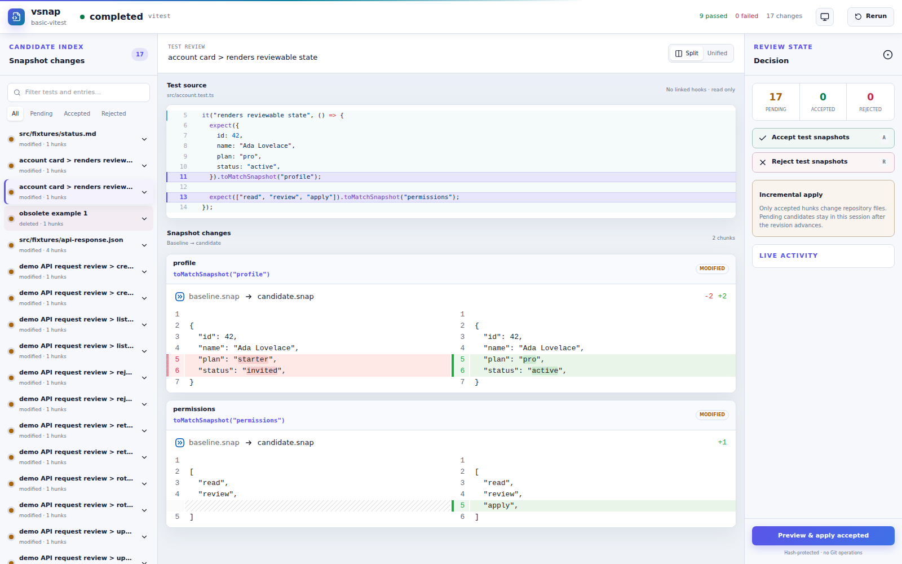
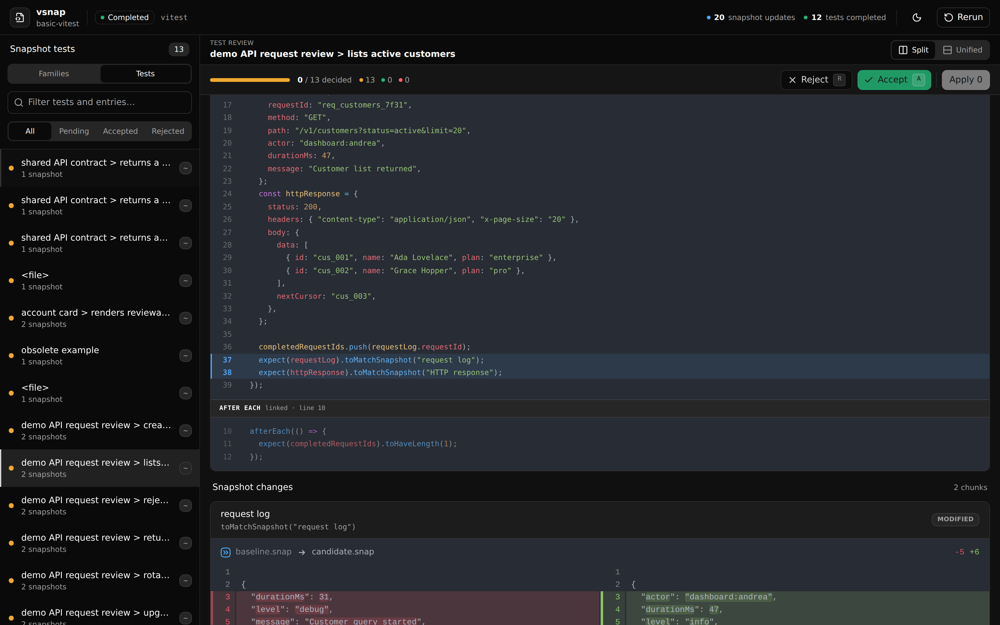

# vitest-snapshot-tools

[](https://github.com/atombarel/vitest-snapshot-tools/actions/workflows/ci.yml)
[](https://www.npmjs.com/package/vitest-snapshot-tools)
[](LICENSE)
[](https://vitest.dev/)

Review Vitest snapshot updates in a local UI, approve only the changes you
intend to keep, and write them to the repository in one explicit step.

`vitest-snapshot-tools` runs your project's own Vitest installation and captures
snapshot candidates in the OS cache. Snapshot files in the repository are not
changed during the run. Accepted changes reach them only when you run
`vsnap apply` or choose **Preview & apply accepted** in the UI.



## Why use it?

Running `vitest -u` writes every updated snapshot immediately. That is convenient
for small changes, but harder to trust when a run updates many snapshots or when
an automated agent is doing the review.

`vitest-snapshot-tools` separates snapshot generation from repository writes:

1. **Capture** — run Vitest with an overlay snapshot environment and store the
   baseline and candidate outside the repository.
2. **Review** — compact identical added and removed lines into exact change
   families, or inspect the owning test, linked hooks, snapshot matcher, and
   full diff.
3. **Decide** — accept or reject a family, file, test, entry, or individual
   diff hunk.
4. **Preview** — inspect the exact patch assembled from accepted hunks.
5. **Apply** — hash-check the baseline and atomically write only accepted
   changes.
6. **Verify** — run Vitest again and confirm no unexpected snapshot changes
   remain.

The tool never invokes Git, so it works the same in a clean tree, a dirty tree,
or outside a Git repository.

## Requirements

- Node.js 22.14 or newer (tested on Node.js 22, 24, and 26)
- A project-local Vitest version in the `>=4 <5` range
- macOS or Linux (the platforms currently covered by CI)

## Quick start

Run the published package from the root of any Vitest project:

```sh
npx vitest-snapshot-tools
```

`npx` uses the project-local package when it is installed and downloads it for
a one-off run otherwise. To pin the version for a project or team, add it as a
development dependency:

```sh
npm install --save-dev vitest-snapshot-tools
npx vitest-snapshot-tools -- --project unit
```

Everything after `--` is passed directly to Vitest. With no Vitest arguments,
`npx vitest-snapshot-tools` reviews the project's default Vitest configuration.

The CLI prints the local review URL if a browser cannot be opened automatically.
The server listens locally and requires a per-process bearer token.

## Try the demo from source

The repository includes an intentionally out-of-date Vitest project. It covers
normal `.snap` files, Markdown and JSON file snapshots, a deleted snapshot,
multi-hunk diffs, and tests that create multiple snapshots from one source block.

```sh
git clone https://github.com/atombarel/vitest-snapshot-tools.git
cd vitest-snapshot-tools
corepack enable
pnpm install --frozen-lockfile
pnpm build
pnpm --filter @vitest-snapshot-tools/example-basic review
```

Select a change in the left panel, compare the test source and snapshot output,
then accept or reject that test's snapshots. Applying is optional; capture and
review do not modify the example snapshots.



If you apply changes while exploring the demo, restore its fixtures with:

```sh
git restore examples/basic-vitest
```

## Common workflows

### Review in the browser

```sh
# Run the default Vitest configuration and open the review UI
npx vitest-snapshot-tools

# Pass a file filter or any supported Vitest arguments
npx vitest-snapshot-tools -- src/account.test.ts --project unit

# Reopen the local UI without starting another run
npx vitest-snapshot-tools ui --no-run

# Reopen one known session
npx vitest-snapshot-tools ui --no-run --session <session-id>
```

### Review from the CLI

Every command supports `--json`, which returns a versioned envelope suitable for
scripts and agents.

```sh
# Capture candidates without opening the UI
npx vitest-snapshot-tools run --json -- src/account.test.ts

# Inspect the newest session for this repository
npx vitest-snapshot-tools list --kind family --status pending
npx vitest-snapshot-tools diff entry_... --format unified

# Decide at family, entry, hunk, test, file, or entire-run scope
npx vitest-snapshot-tools accept family_...
npx vitest-snapshot-tools accept entry_...
npx vitest-snapshot-tools reject hunk_...

# Inspect exactly what would be written, then apply and verify
npx vitest-snapshot-tools preview --format patch
npx vitest-snapshot-tools apply
npx vitest-snapshot-tools verify
```

Commands use the newest session for the current canonical repository unless you
pass `--session <session-id>`.

## CLI reference

| Command | Purpose |
| --- | --- |
| `vsnap [ui] -- [vitest args]` | Start a capture, open the local UI, and stream run events |
| `vsnap run -- [vitest args]` | Capture headlessly and print the session ID |
| `vsnap sessions` | List cached review sessions for the current repository |
| `vsnap status [session]` | Show run state, revision, and snapshot-change count |
| `vsnap list [session]` | List family, file, test, entry, or hunk selectors; filter with `--kind` and `--status` |
| `vsnap diff <entry>` | Print an entry as a unified diff or summary |
| `vsnap accept <selector>` | Accept a family, file, test, entry, hunk, or `--all` |
| `vsnap reject <selector>` | Reject a family, file, test, entry, hunk, or `--all` |
| `vsnap preview [session]` | Print the decision summary or exact patch with `--format patch` |
| `vsnap apply [session]` | Write accepted changes while leaving pending work in the session |
| `vsnap verify [session]` | Run a child capture to check the applied result |
| `vsnap clean` | Remove sessions with `--older-than 2d` or remove all with `--all` |
| `vsnap skill install` | Install the bundled `review-vitest-snapshots` Codex skill |

## Safety model

- **No snapshot writes during capture.** A custom snapshot environment redirects
  Vitest's baseline and candidate data to a private cache directory.
- **Explicit decisions.** Pending and rejected hunks never enter an apply plan.
- **Stale-write protection.** Apply stops if a repository snapshot no longer
  matches the baseline hash captured by the session.
- **Contained paths.** Apply rejects paths outside the repository and refuses
  symlinked snapshot targets.
- **Crash-aware writes.** Files are prepared before writing; an apply journal and
  backups allow a failed multi-file write to roll back.
- **Local, authenticated UI.** The server uses a random bearer token and does not
  expose unauthenticated API routes.
- **No Git dependency.** No Git command is run during capture, review, apply, or
  verification.

Sessions are stored in the platform cache directory (`~/.cache` on Linux and
`~/Library/Caches` on macOS by default). Sessions older than seven days are
cleaned automatically, and the newest 20 sessions are retained per canonical
repository.

## Current limitations

The current version intentionally supports a narrow, predictable workflow:

- Vitest 4 in Node mode only
- External `.snap` files and `toMatchFileSnapshot` file snapshots
- No watch mode, Vitest UI/API mode, or browser projects
- No custom `snapshotEnvironment`
- Inline snapshot changes are detected and reported, but cannot be applied
- One active capture per process

## Agent integration

The package includes a `review-vitest-snapshots` skill for Codex-compatible agent
workflows:

```sh
npx vitest-snapshot-tools skill install
```

The skill uses the JSON CLI rather than bypassing the decision and apply model.
See [`skills/review-vitest-snapshots`](skills/review-vitest-snapshots/SKILL.md)
for its workflow and response contract.

## Contributing

Bug reports, small fixes, and focused pull requests are welcome. Please use
[GitHub Issues](https://github.com/atombarel/vitest-snapshot-tools/issues) for
reproducible bugs and open an issue before starting a substantial behavior or
protocol change.

### Development setup

```sh
corepack enable
pnpm install --frozen-lockfile
pnpm check
pnpm test:e2e
```

The monorepo separates the protocol, diff engine, session store, Vitest runner,
application service, local server, CLI, React UI, published package, example,
and agent skill. Turbo coordinates builds and tests; Biome handles linting and
formatting.

To refresh the README images after a UI change, install Playwright's Chromium
once and run:

```sh
pnpm exec playwright install chromium
pnpm docs:screenshots
```

Before opening a pull request, run `pnpm check`, `pnpm test:e2e`, and
`pnpm skill:validate`. User-facing package changes should include a Changeset:

```sh
pnpm changeset
```

Package releases are published from version tags through npm trusted
publishing. See [RELEASING.md](RELEASING.md) for the one-time npm setup and
release procedure.

## License

[MIT](LICENSE) © vitest-snapshot-tools contributors
